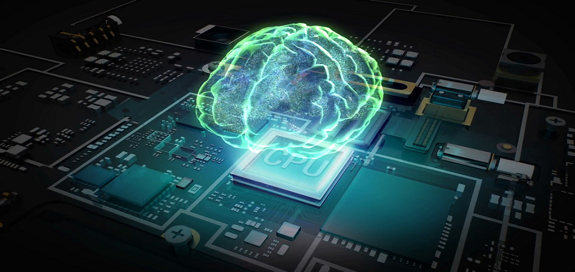

### Hi there 👋

I'm a Machine Learning and Data Science enthusiast.   
I've done projects regarding machine learning, artificial intelligence, data science, deep learning & neural networks.   

You can check my end-to-end projects :
* [Flight Fare Prediction ML flask web-app](https://github.com/Prajwal10031999/Flight-Fare-Prediction-ML-Web-App-With-Deployment)

Also you'll find some projects regarding Deep Learning with transfer learning techniques viz : 

* [VGG](https://github.com/Prajwal10031999/Cataract-Detection-using-VGG-19)
* [RESNET](https://github.com/Prajwal10031999/Cats-or-Dogs-Classification-using-CNN-with-RESNET-50)
* [INCEPTION](https://github.com/Prajwal10031999/Dog-Breed-Classification-Using-InceptionV3)
* [ALEXNET](https://github.com/Prajwal10031999/Scene-Prediction-using-CNN-with-AlexNet)
* [MOBILENET](https://github.com/Prajwal10031999/Face-Mask-Detection-Using-MobileNETV2-)
* [DENSENET](https://github.com/Prajwal10031999/Alzheimer-s-Classification-using-DenseNet169)

Also you can find some projects on Artificial Intelliegence in Medical Science
* [Cataract-Detection-using-VGG-19](https://github.com/Prajwal10031999/Cataract-Detection-using-VGG-19)
* [Alzheimer-s-Classification-using-DenseNet169](https://github.com/Prajwal10031999/Alzheimer-s-Classification-using-DenseNet169)
* [Diabetes-Prediction-using-Logistic-Regression](https://github.com/Prajwal10031999/Diabetes-Prediction-using-Logistic-Regression)

And some of my Machine Learning Projects viz :
* [Movie-Recommendation-System](https://github.com/Prajwal10031999/Movie-Recommendation-System-Using-Cosine-Similarity/blob/main/imdb_recommendation_system.py)
* [Credit-Card-Fraud-Detection](https://github.com/Prajwal10031999/Credit-Card-Fraud-Detection-using-Random-Forest)
* [Diabetes-Prediction](https://github.com/Prajwal10031999/Diabetes-Prediction-using-Logistic-Regression)
* [Titanic-Passenger-Survival-Predictions](https://github.com/Prajwal10031999/Titanic-Passenger-Survival-Predictions-using-machine-learning)

You can find me [Here](https://www.linkedin.com/in/prajwal-shegaonkar-b94a23183/)
